# Provisioning an Amazon RDS (MySQL) Instance with a Terraform S3 Remote Backend
 
A beginner-friendly, hands-on Terraform project that provisions a **MySQL RDS instance** inside a custom VPC, while storing Terraform's state file remotely and safely in **Amazon S3** with **DynamoDB state locking**.
 
This project is designed for people who are **new to Terraform** — every step is explained in plain language, with placeholders for screenshots so you can follow along visually.
 
---
 
## Architecture Diagram
 
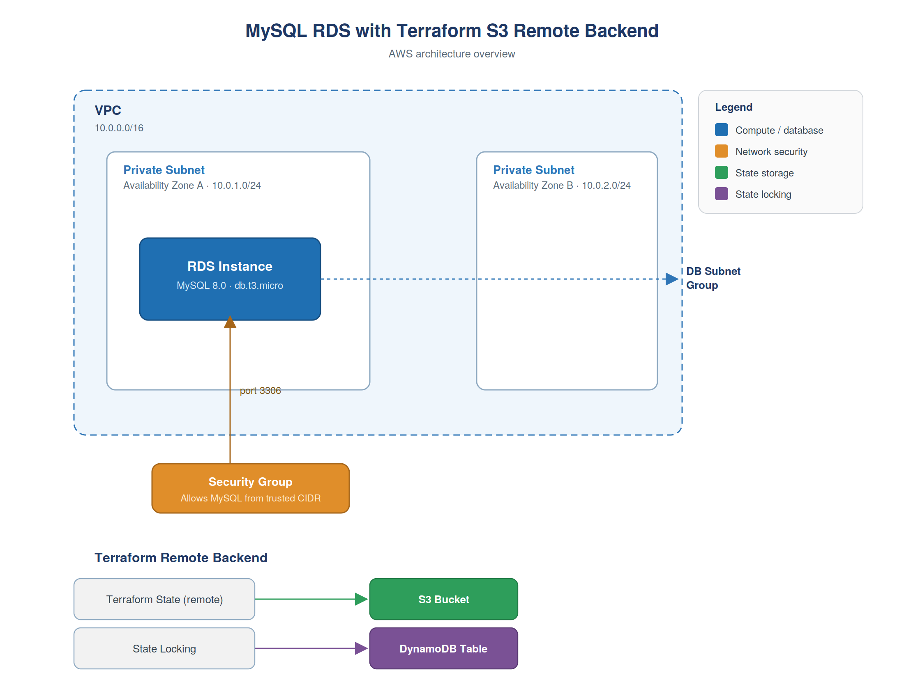
The diagram shows the two halves of this project:
 
- **Terraform remote backend** (bottom) — an S3 bucket stores the state file, and a DynamoDB table locks it during `apply`.
- **Application infrastructure** (the VPC) — two private subnets host the RDS instance through a DB subnet group, and a security group is the only thing allowed to reach it, on port 3306.
---
 
## Why a Remote Backend?
 
If you're new to Terraform, you might be wondering why we don't just let Terraform save its state file (`terraform.tfstate`) on our own laptop (the default behavior). Here's why a **remote backend** matters:
 
- **Team collaboration** — Multiple people can safely work on the same infrastructure.
- **State locking** — DynamoDB prevents two `terraform apply` runs from corrupting the state at the same time. Newer Terraform versions also support native S3 state locking.
- **Durability** — S3 is highly durable; you won't lose your state file if your laptop dies.
- **Security** — State files often contain sensitive data (like DB passwords); S3 lets you encrypt and restrict access.
---
 
## Prerequisites
 
Before starting, make sure you have:
 
- [ ] An **AWS account** with programmatic (CLI) access
- [ ] **AWS CLI** installed and configured (`aws configure`)
- [ ] **Terraform** installed (v1.5+ recommended)
- [ ] Basic familiarity with the terminal/command line
- [ ] An IAM user/role with permissions for: S3, DynamoDB, VPC, RDS, EC2 (security groups)
 
---
 
## Project Structure
 
```
terraform-mysql-rds-s3-backend/
├── backend-setup/
│   └──main.tf              # Creates the S3 bucket + DynamoDB table (run ONCE, separately)
│
├── main-infra/
│   ├── backend.tf            # Points Terraform to the S3 bucket + DynamoDB table
│   ├── provider.tf           # AWS provider configuration
│   ├── vpc.tf                # VPC + private subnets
│   ├── security-group.tf     # MySQL security group
│   ├── rds.tf                # RDS instance + DB subnet group
│   ├── variables.tf          # Input variables
│   ├── outputs.tf            # RDS endpoint output
│   └── terraform.tfvars      # Variable values (DO NOT commit passwords here in real projects)
├── .gitignore
└── README.md
```
 
> Note: We split this into two folders because the S3 bucket/DynamoDB table (the backend itself) must exist **before** Terraform can use them as a backend. You can't create the backend and use it in the very same `apply`.
 
---
 
## Step-by-Step Guide
 
### Step 1: Set Up the S3 Bucket + DynamoDB Table
 
This is a **one-time setup** step. Run this from the `backend-setup/` folder using Terraform's default **local** state (since the remote backend doesn't exist yet).
 
Yes — `main.tf` is required here. It's a normal Terraform file that defines the S3 bucket and DynamoDB table as regular resources. Because the remote backend doesn't exist yet, Terraform has no choice but to track this apply with a local `terraform.tfstate` file, sitting right next to this `main.tf`.
 
```hcl
# backend-setup/main.tf
 
resource "aws_s3_bucket" "terraform_state" {
  bucket = "my-terraform-state-bucket-rds-demo"   # must be globally unique — change this
  
  # This lifecycle prevent_destroy is not required for demo, because terraform destroy will fail for the S3 bucket
  lifecycle {
    prevent_destroy = true 
  }
 
  tags = {
    Name = "terraform-state-bucket"
  }
}
 
resource "aws_s3_bucket_versioning" "terraform_state" {
  bucket = aws_s3_bucket.terraform_state.id
 
  versioning_configuration {
    status = "Enabled"
  }
}
 
resource "aws_s3_bucket_server_side_encryption_configuration" "terraform_state" {
  bucket = aws_s3_bucket.terraform_state.id
 
  rule {
    apply_server_side_encryption_by_default {
      sse_algorithm = "AES256"
    }
  }
}
 
resource "aws_dynamodb_table" "terraform_locks" {
  name         = "terraform-locks"
  billing_mode = "PAY_PER_REQUEST"
  hash_key     = "LockID"
 
  attribute {
    name = "LockID"
    type = "S"
  }
 
  tags = {
    Name = "terraform-state-lock-table"
  }
}
```
 
```bash
cd backend-setup
terraform init
terraform plan
terraform apply
```
 
This creates:
- An S3 bucket (versioning + encryption enabled) to store `terraform.tfstate`
- A DynamoDB table with a primary key `LockID` (String) for state locking
> S3 bucket created in the AWS Console
>
> 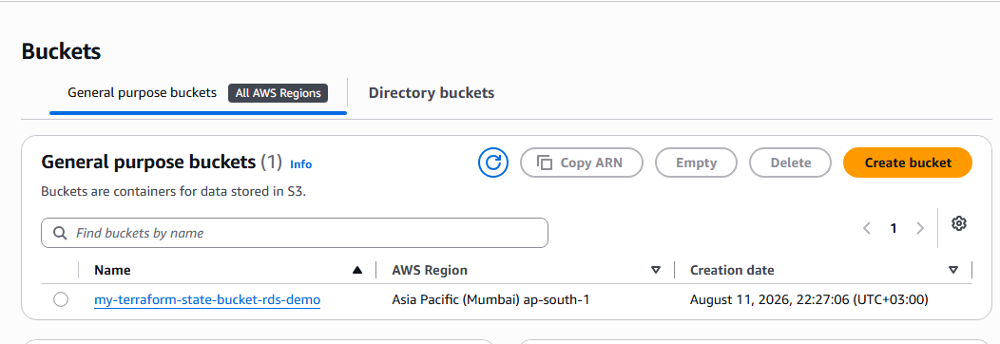
 
> DynamoDB table created in the AWS Console
>
> 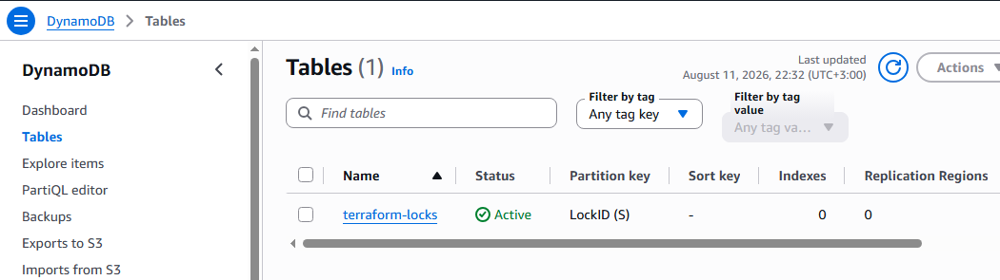
 
> Terraform apply output for backend-setup
>
> 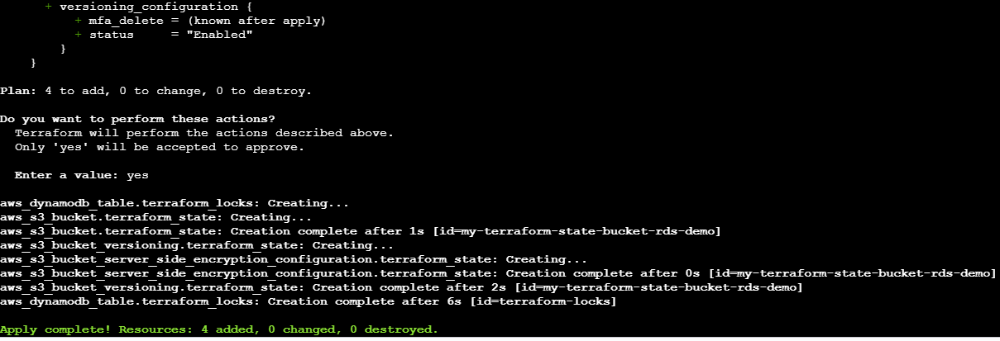
 
---
 
### Step 2: Configure the Terraform Backend
 
Now move into `main-infra/` and point Terraform to the S3 bucket and DynamoDB table you just created, using a `backend.tf` file.
 
```hcl
terraform {
  backend "s3" {
    bucket         = "my-terraform-state-bucket-rds-demo"
    key            = "rds/terraform.tfstate"
    region         = "ap-south-1"
    dynamodb_table = "terraform-locks"
    encrypt        = true
  }
}
```
 
> Note: Bucket names must be **globally unique** across all of AWS. Change `my-terraform-state-bucket-rds-demo` to something unique to you.

> `key` isn't a credential — it's just the file path *inside* the S3 bucket where this project's state file will be stored.

> backend.tf file in your editor
>
> 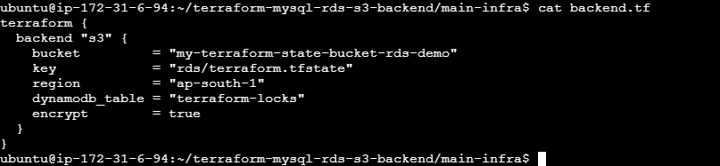

**One more file before moving on:** create `provider.tf` alongside it. The `region` set inside `backend "s3" {}` above only controls where the *state file* lives — it has no effect on where your actual resources (VPC, RDS, etc.) get created. Without a `provider` block, that decision falls back silently to whatever `AWS_REGION` is set, or your `~/.aws/config`, or — if you're running this from an EC2 instance with an IAM role and nothing else configured
 
```hcl
# provider.tf
provider "aws" {
  region = "ap-south-1"   # match this to the region you actually want your infrastructure in
}
```
 
At this point you can optionally run `terraform init` just to confirm Terraform connects to the S3 backend successfully:
 
```bash
terraform init
```
 
You should see `Successfully configured the backend "s3"!` in the output. There's nothing to `plan` or `apply` yet, though — `vpc.tf`, `security-group.tf`, and `rds.tf` don't exist until Steps 3–6, and the real `init` → `plan` → `apply` workflow for the full project happens together in Step 7.

> 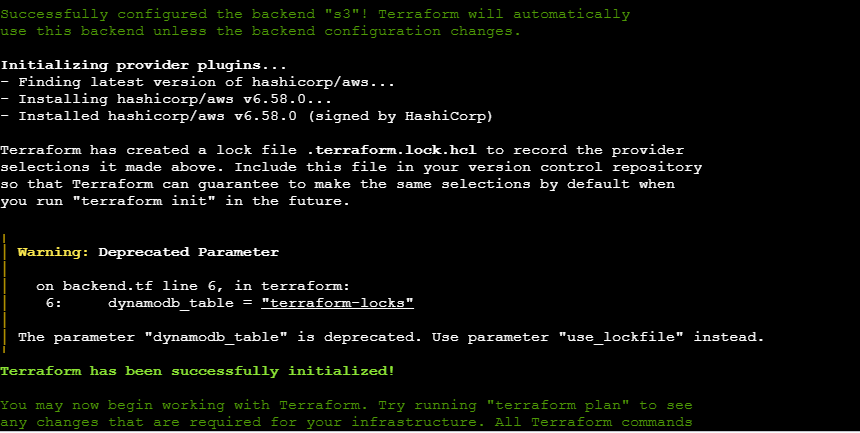

---

### Step 3: Create the VPC and Private Subnets
 
We create a dedicated VPC with **two private subnets** in different Availability Zones (RDS requires a minimum of 2 AZs for its subnet group, even for a single-AZ instance).
 
Save this as `vpc.tf` inside `main-infra/` (alongside the `backend.tf` and `provider.tf` you created in Step 2):
 
```hcl
# vpc.tf
resource "aws_vpc" "main" {
  cidr_block           = "10.0.0.0/16"
  enable_dns_support   = true
  enable_dns_hostnames = true
 
  tags = {
    Name = "rds-demo-vpc"
  }
}
 
resource "aws_subnet" "private_1" {
  vpc_id            = aws_vpc.main.id
  cidr_block        = "10.0.1.0/24"
  availability_zone = "ap-south-1a"
 
  tags = {
    Name = "rds-private-subnet-1"
  }
}
 
resource "aws_subnet" "private_2" {
  vpc_id            = aws_vpc.main.id
  cidr_block        = "10.0.2.0/24"
  availability_zone = "ap-south-1b"
 
  tags = {
    Name = "rds-private-subnet-2"
  }
}
```
 
> VPC and subnets visible in AWS Console
>
> 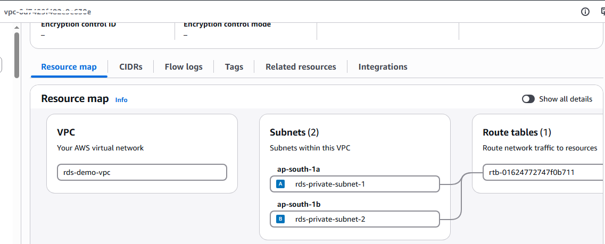
 
Don't run `terraform apply` yet — `main-infra/` isn't finished. Keep adding files through Step 6 (DB subnet group, security group, RDS instance), and Step 7 covers running `init` → `plan` → `apply` once for the whole set at once.
 
---
 
### Step 4: Create the DB Subnet Group
 
A **DB Subnet Group** tells RDS exactly which subnets it is allowed to place the database's network interfaces in.
 
Save this as `rds.tf` inside `main-infra/` — this is the same file the RDS instance itself and the endpoint output will go into (Step 6 adds to it):
 
```hcl
# rds.tf
resource "aws_db_subnet_group" "rds_subnet_group" {
  name       = "rds-demo-subnet-group"
  subnet_ids = [aws_subnet.private_1.id, aws_subnet.private_2.id]
 
  tags = {
    Name = "rds-demo-subnet-group"
  }
}
```
 
> DB Subnet Group in RDS Console
>
> 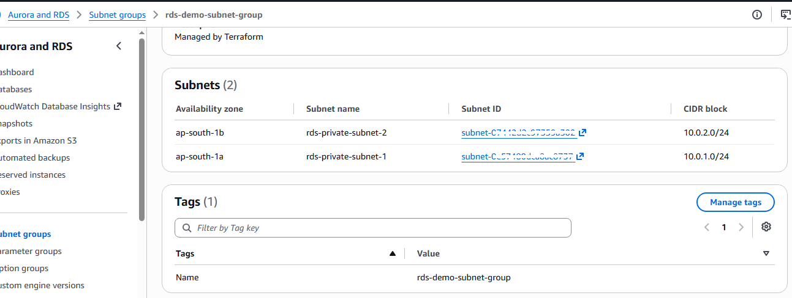
 
---
 
### Step 5: Create the Security Group
 
This firewall rule allows inbound traffic **only on port 3306 (MySQL)**, restricted to a specific CIDR block or an EC2 security group — never open it to `0.0.0.0/0` in a real environment.
 
Save this as `security-group.tf` inside `main-infra/`:
 
```hcl
# security-group.tf
resource "aws_security_group" "rds_sg" {
  name        = "rds-mysql-sg"
  description = "Allow MySQL access from trusted source"
  vpc_id      = aws_vpc.main.id
 
  ingress {
    description = "MySQL access"
    from_port   = 3306
    to_port     = 3306
    protocol    = "tcp"
    cidr_blocks = ["10.0.0.0/16"]   # Replace with your trusted CIDR or use security_groups = [aws_security_group.ec2_sg.id]
  }
 
  egress {
    from_port   = 0
    to_port     = 0
    protocol    = "-1"
    cidr_blocks = ["0.0.0.0/0"]
  }
 
  tags = {
    Name = "rds-mysql-sg"
  }
}
```
 
> Security Group inbound rules
>
> 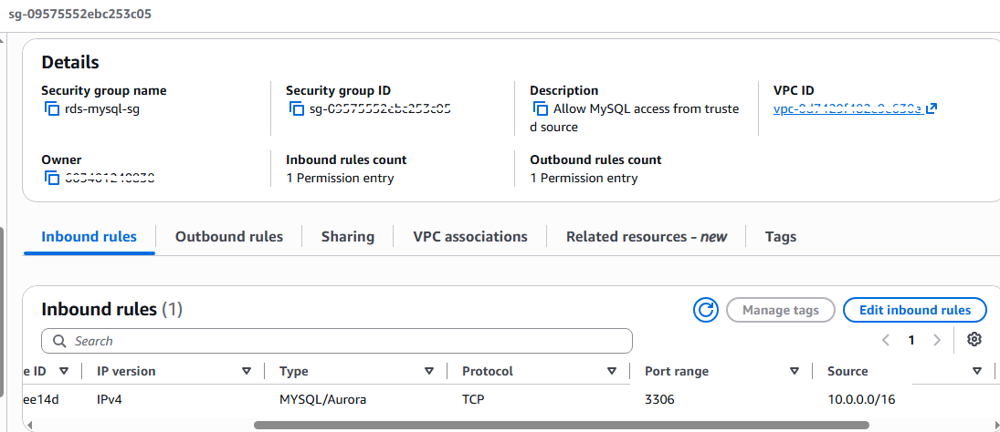
 
---
---
 
### Step 6: Provision the RDS Instance
 
Finally, the main event — using the small db.t3.micro instance class to keep this lab low-cost. Check your AWS account's current Free Tier/Free Plan eligibility before creating the instance.
 
First, save this as `variables.tf` inside `main-infra/` — it declares the two inputs the RDS resource below needs, and marks them `sensitive` so Terraform hides them from normal Terraform CLI output.
 
```hcl
# variables.tf
variable "db_username" {
  description = "Master username for the RDS instance"
  type        = string
  sensitive   = true
}
 
variable "db_password" {
  description = "Master password for the RDS instance"
  type        = string
  sensitive   = true
}
```
 
Then add this to the same `rds.tf` file you started in Step 4, right after the `aws_db_subnet_group` resource:
 
```hcl
# rds.tf (continued)
resource "aws_db_instance" "mysql" {
  identifier             = "rds-demo-mysql"
  engine                 = "mysql"
  engine_version         = "8.0"
  instance_class         = "db.t3.micro"
  allocated_storage      = 20
  storage_type           = "gp3"
 
  db_name                = "demodb"
  username               = var.db_username
  password               = var.db_password
 
  db_subnet_group_name   = aws_db_subnet_group.rds_subnet_group.name
  vpc_security_group_ids = [aws_security_group.rds_sg.id]
 
  publicly_accessible    = false
  multi_az               = false
  skip_final_snapshot    = true
 
  tags = {
    Name = "rds-demo-mysql"
  }
}
```
 
> Beginner tip: Never hardcode `username`/`password` directly in `.tf` files. Use variables (`var.db_username`, `var.db_password`) marked as `sensitive = true`, or better, pull them from **AWS Secrets Manager** or environment variables.
 
The actual values for `db_username`/`db_password` go in `terraform.tfvars` (also inside `main-infra/`) — this file holds real secrets, so add it to `.gitignore` and never commit it:
 
```hcl
# terraform.tfvars — do not commit this file
db_username = "admin"
db_password = "choose-a-strong-password-here"
```
 
Last file for this step — save this as `outputs.tf` inside `main-infra/`:
 
```hcl
# outputs.tf
output "rds_endpoint" {
  description = "Connection endpoint for the MySQL RDS instance"
  value       = aws_db_instance.mysql.endpoint
}
```
 
> RDS instance "Available" status in AWS Console
>
> 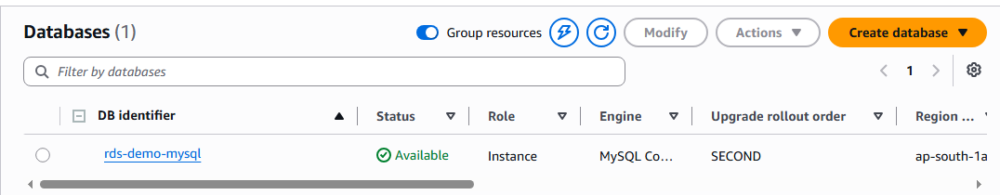
 
At this point, `main-infra/` should have all the files from Steps 2–6 in place: `backend.tf`, `provider.tf`, `vpc.tf`, `security-group.tf`, `rds.tf`, `variables.tf`, `outputs.tf`, and `terraform.tfvars`. Nothing has been run yet — Step 7 is where you actually execute everything together.
 
---
 
### Step 7: Initialize, Plan, and Apply
 
Now run the standard Terraform workflow inside `main-infra/`:
 
```bash
cd main-infra
terraform init      # Downloads providers + connects to the S3 backend
terraform plan       # Shows what will be created
terraform apply       # Creates everything (type 'yes' to confirm)
```
 
> `terraform init` output showing "Successfully configured the backend s3!"
>
> 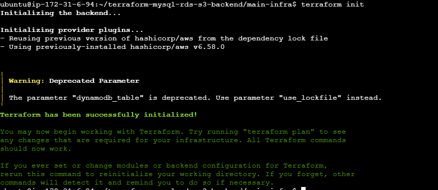
 
> `terraform plan` output summary
>
> 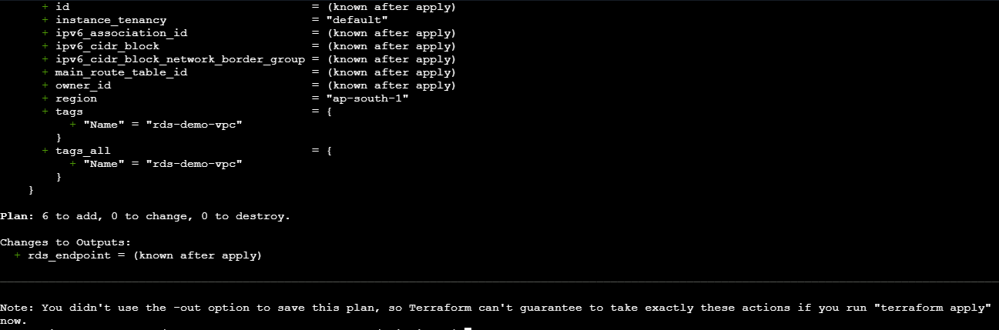
 
> `terraform apply` completed successfully
>
> 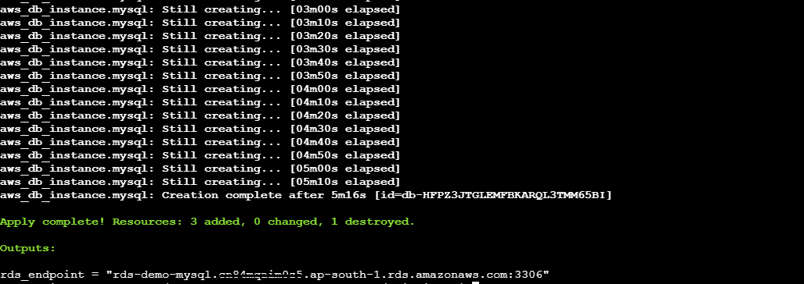
 
---
 
### Step 8: Verify the RDS Endpoint Output
 
Once `apply` finishes, Terraform will print the RDS endpoint in the terminal:
 
```
Outputs:
 
rds_endpoint = "rds-demo-mysql.xxxxxxxxxxxxx.ap-south-1.rds.amazonaws.com:3306"
```
 
You can also retrieve it any time with:
 
```bash
terraform output rds_endpoint
```
 
> Terminal showing the RDS endpoint output
>
> 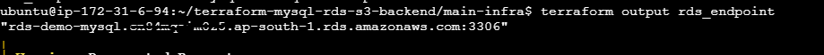
 
---
 
## Testing the Connection
 
Since the RDS instance sits in **private subnets**, you'll need a bastion host / EC2 instance inside the same VPC (or a VPN) to connect. From that instance:
 
```bash
mysql -h <rds_endpoint> -P 3306 -u <db_username> -p
```
 
> Note: This was tested by connecting from a separate EC2 instance in a different VPC via a VPC peering connection. Alternatively, you can launch another EC2 instance in a public subnet of the same VPC as the RDS instance.

> Successful MySQL connection from a bastion EC2
>
> 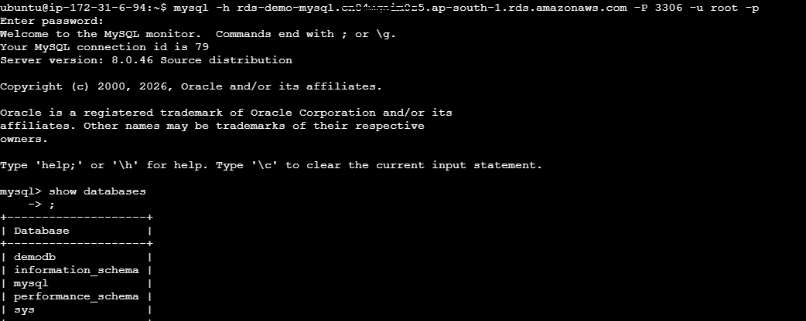
 
---
 
## Cleaning Up (Destroy Resources)
 
To avoid ongoing AWS charges, destroy resources in **reverse order**:
 
```bash
# 1. Destroy the main infrastructure first
cd main-infra
terraform destroy
 
# 2. Then destroy the backend resources (only after nothing else uses them)
cd ../backend-setup
terraform destroy
```
 
> Important: Never destroy the S3 bucket/DynamoDB table (`backend-setup`) while `main-infra` still references them as its backend — always tear down `main-infra` first.
 
--- 

## Troubleshooting

| Issue | Cause | Fix |
|---|---|---|
| RDS subnet group error | Only 1 AZ/subnet | Add subnets in 2+ AZs |
| S3 backend bucket not found | Backend not created | Run `backend-setup` first |
| State lock error | Another run/ stale lock | Wait or remove stale lock |
| RDS connection timeout | SG/routing issue | Check SG and connect from VPC |
| Backend init failure | Wrong bucket/region | Verify `backend.tf` values |
| Terraform Registry connection failure | No outbound internet | Check routes, NAT/IGW, SG/NACL and port 443 |
| `dynamodb_table` deprecated warning | Terraform 1.10+ | Safe to ignore; DynamoDB locking is required for this lab |
 
---
 
## Key Terraform Concepts Used
 
- **Backend Configuration** (`terraform { backend "s3" {} }`) — remote state storage
- **State Locking** — DynamoDB prevents concurrent state corruption
- **Resource Dependencies** — Terraform automatically sequences VPC → Subnets → Subnet Group → Security Group → RDS
- **Variables & Outputs** — parameterizing sensitive/reusable values, exposing the RDS endpoint
- **Modules-ready structure** — this project can easily be refactored into reusable Terraform modules later

---
 
## Next Steps
 
- Add a bastion host module to test connectivity end-to-end
- Move `db_username`/`db_password` to **AWS Secrets Manager**
- Add **Multi-AZ** and **automated backups** for production readiness
- Convert this into reusable Terraform **modules** (`modules/vpc`, `modules/rds`, `modules/security-group`)

---
## Author

**Sinsha C**

[](https://github.com/sinsha-c)
[](https://linkedin.com/in/sinshac)
 
